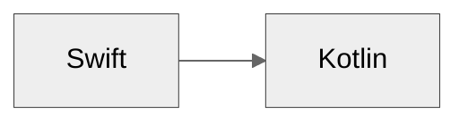

Skip is a Swift to Kotlin transpiler.

```mermaid
%%{init: {'theme': 'neutral', "flowchart" : { "curve" : "basis" } } }%%
graph LR
    A[Swift] --> B[Kotlin]

classDef default stroke:#333,stroke-width:0.5px,font-family:Helvetica;
```
